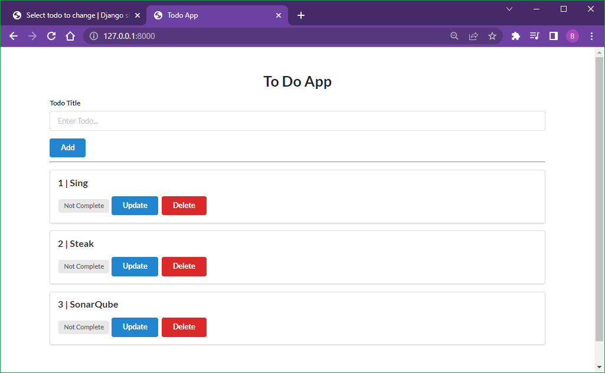
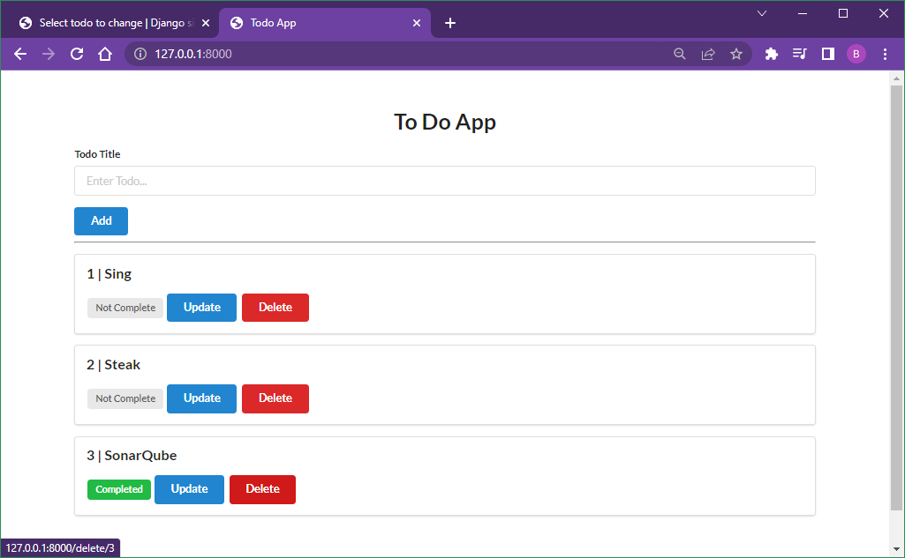
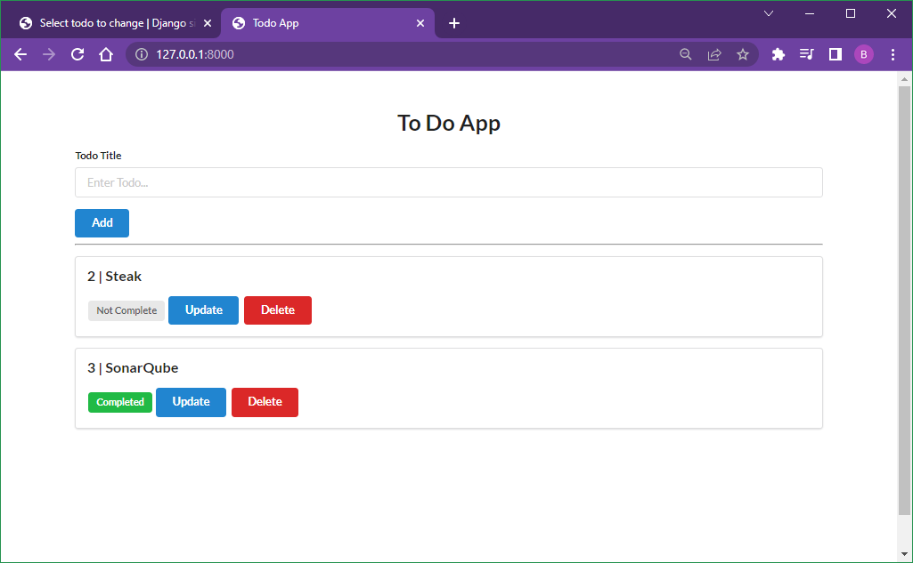
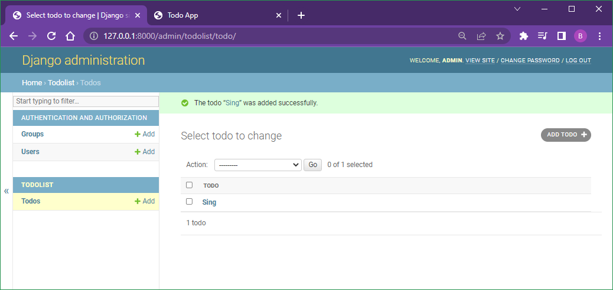

# Django vs Flask vs FastAPI - Django

Django

## Commands

```
py -m venv venv
venv\scripts\activate
pip install Django
```

```
django-admin startproject todoapp
cd todoapp
py manage.py runserver
```

```
cd todoapp
py manage.py startapp todolist
```

todoapp/settings.py

```
INSTALLED_APPS = [
    ...
    'todolist'
]
```

edit todolist/views.py

add a new file todolist/urls.py

edit todoapp/urls.py

create a new template folder: todoapp/templates

create a new template file: todoapp/templates/base.html

add a `` in the base.html

edit todolist/models.py

```
cd todoapp
py manage.py makemigrations
py manage.py migrate
py manage.py createsuperuser
py manage.py runserver
```

edit todolist/admin.py

```
http://localhost:8000/admin
```

```
http://localhost:8000
```

```

```

### Output

```
(venv) C:\Code\MyPython\Django-Flask-FastAPI\django-app\todoapp>py manage.py runserver
Watching for file changes with StatReloader
Performing system checks...

System check identified no issues (0 silenced).

You have 18 unapplied migration(s). Your project may not work properly until you apply the migrations for app(s): admin, auth, contenttypes, sessions.
Run 'python manage.py migrate' to apply them.
March 12, 2022 - 10:41:25
Django version 4.0.3, using settings 'todoapp.settings'
Starting development server at http://127.0.0.1:8000/
Quit the server with CTRL-BREAK.
```

```
(venv) C:\Code\MyPython\Django-Flask-FastAPI\django-app\todoapp>py manage.py makemigrations
Migrations for 'todolist':
  todolist\migrations\0001_initial.py
    - Create model Todo
```

```
(venv) C:\Code\MyPython\Django-Flask-FastAPI\django-app\todoapp>py manage.py migrate
Operations to perform:
  Apply all migrations: admin, auth, contenttypes, sessions, todolist
Running migrations:
  Applying contenttypes.0001_initial... OK
  Applying auth.0001_initial... OK
  Applying admin.0001_initial... OK
  Applying admin.0002_logentry_remove_auto_add... OK
  Applying admin.0003_logentry_add_action_flag_choices... OK
  Applying contenttypes.0002_remove_content_type_name... OK
  Applying auth.0002_alter_permission_name_max_length... OK
  Applying auth.0003_alter_user_email_max_length... OK
  Applying auth.0004_alter_user_username_opts... OK
  Applying auth.0005_alter_user_last_login_null... OK
  Applying auth.0006_require_contenttypes_0002... OK
  Applying auth.0007_alter_validators_add_error_messages... OK
  Applying auth.0008_alter_user_username_max_length... OK
  Applying auth.0009_alter_user_last_name_max_length... OK
  Applying auth.0010_alter_group_name_max_length... OK
  Applying auth.0011_update_proxy_permissions... OK
  Applying auth.0012_alter_user_first_name_max_length... OK
  Applying sessions.0001_initial... OK
  Applying todolist.0001_initial... OK
```

```
(venv) C:\Code\MyPython\Django-Flask-FastAPI\django-app\todoapp>py manage.py createsuperuser
Username (leave blank to use '...'): admin
Email address: admin@admin.com
Password:
Password (again):
The password is too similar to the username.
This password is too short. It must contain at least 8 characters.
This password is too common.
Bypass password validation and create user anyway? [y/N]: y
Superuser created successfully.
```

## Screenshot









## Troubleshooting

```
Method Not Allowed (POST): /add
```
