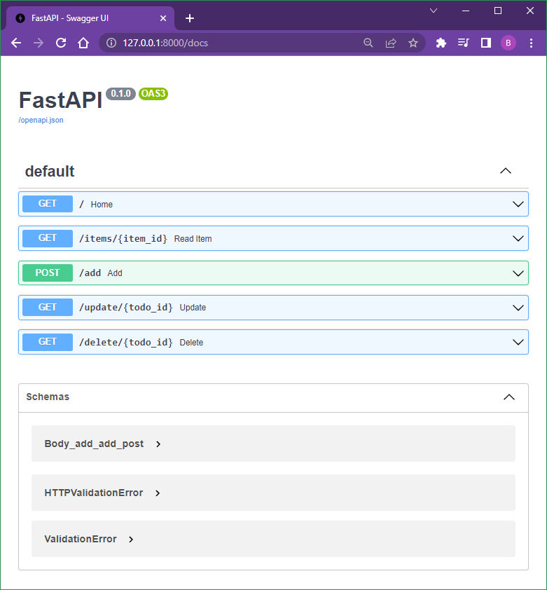

# Django vs Flask vs FastAPI - FastAPI

FastAPI

## Commands

```
py -m venv venv
venv\scripts\activate
pip install fastapi
pip install uvicorn
pip install python-multipart sqlalchemy jinja2
```

1st "app" is the file name
2nd "app" is the application instance

```
uvicorn app:app --reload
```

```
http://localhost:8000
```

Swagger

```
http://localhost:8000/docs
```

### Output

```
(venv) C:\Code\MyPython\Django-Flask-FastAPI\fastapi-app>uvicorn app:app --reload
INFO:     Will watch for changes in these directories: ['C:\\Code\\MyPython\\Django-Flask-FastAPI\\fastapi-app']
INFO:     Uvicorn running on http://127.0.0.1:8000 (Press CTRL+C to quit)
INFO:     Started reloader process [18280] using statreload
WARNING:  The --reload flag should not be used in production on Windows.
INFO:     Started server process [14984]
INFO:     Waiting for application startup.
INFO:     Application startup complete.
```

## Screenshot



