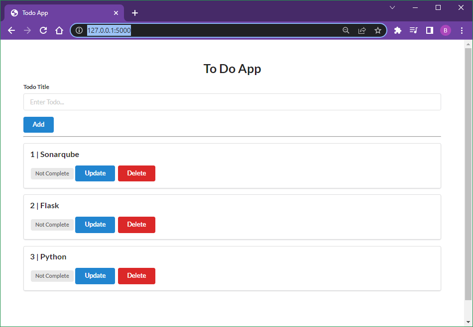
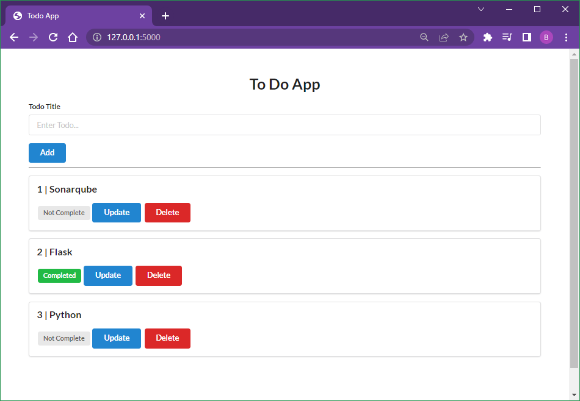
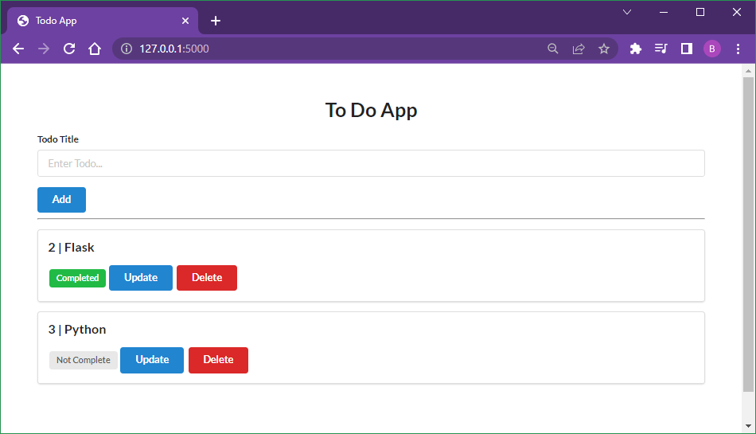

# Django vs Flask vs FastAPI - Flask

Flask

## Commands

```
py -m venv venv
venv\scripts\activate
pip install Flask Flask-SQLAlchemy
```

```
set FLASK_APP=app.py
set FLASK_ENV=development
flask run
```

```
http://127.0.0.1:5000/
```

### Output

```
C:\Code\MyPython\Django-Flask-FastAPI\flask-app>py -m venv venv

C:\Code\MyPython\Django-Flask-FastAPI\flask-app>venv\scripts\activate
```

```
(venv) C:\Code\MyPython\Django-Flask-FastAPI\flask-app>flask run
 * Serving Flask app 'app.py' (lazy loading)
 * Environment: development
 * Debug mode: on
 * Restarting with stat
 * Debugger is active!
 * Debugger PIN: 122-740-672
 * Running on http://127.0.0.1:5000/ (Press CTRL+C to quit)
```

## Screenshot






