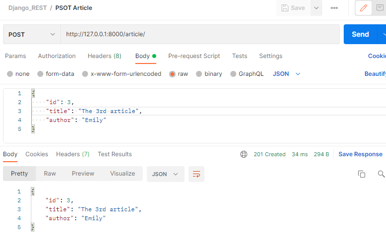
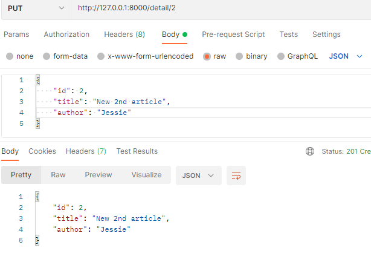
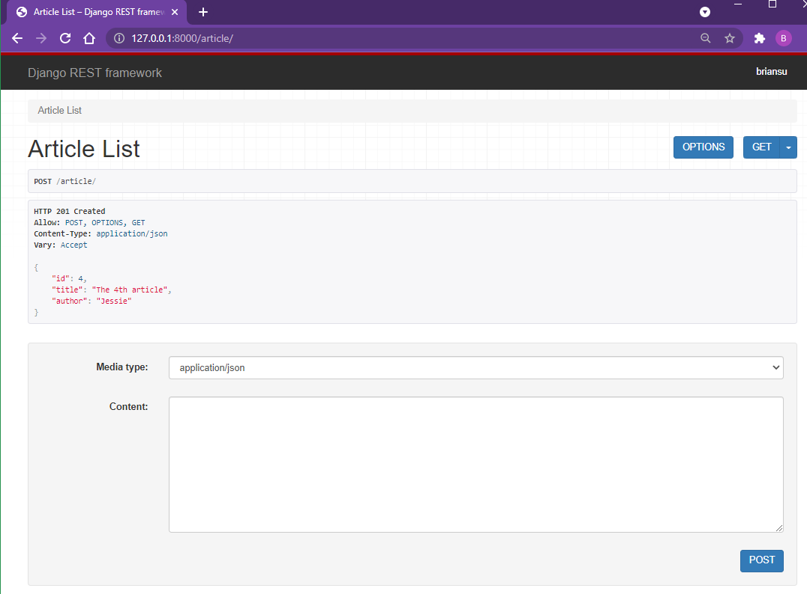
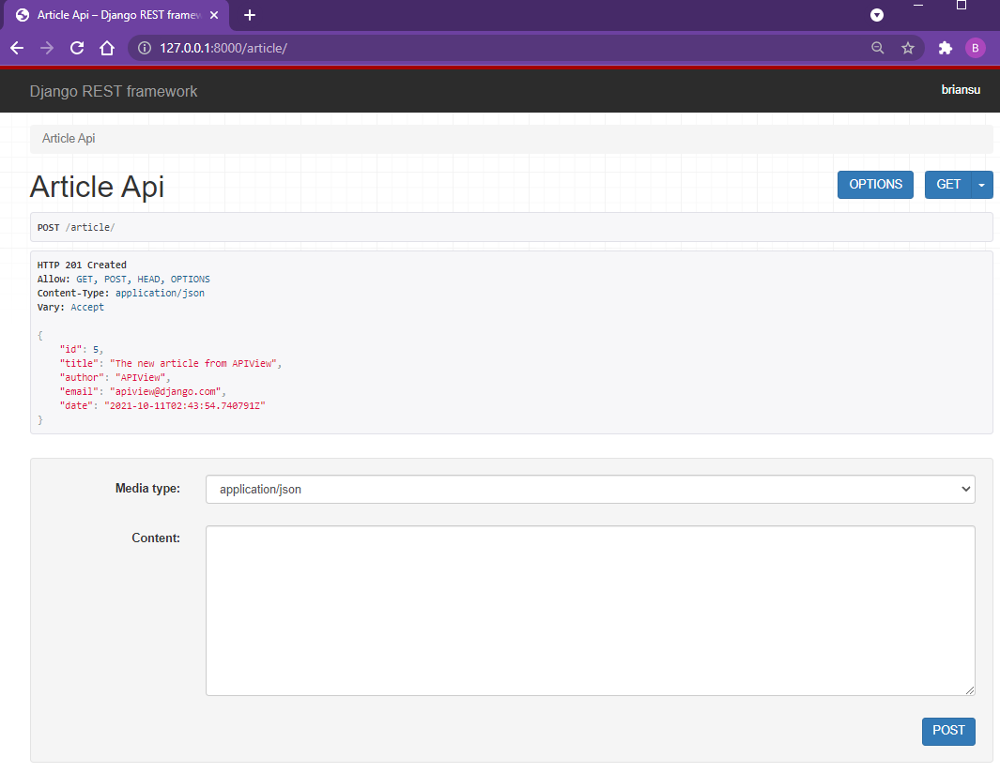

# Django REST simple app

Django is a Python-based free and open-source web framework that follows the model–template–views (MTV) architectural pattern.

Django REST framework is a powerful and flexible toolkit for building Web APIs.

Some reasons you might want to use REST framework:

- The Web browsable API is a huge usability win for your developers.
- Authentication policies including packages for OAuth1a and OAuth2.
- Serialization that supports both ORM and non-ORM data sources.
- Customizable all the way down - just use regular function-based views if you don't need the more powerful features.
- Extensive documentation, and great community support.
- Used and trusted by internationally recognised companies including Mozilla, Red Hat, Heroku, and Eventbrite.

## Set up

```
py --version
py get-pip.py
py -m pip --version
pip install Django
pip install djangorestframework
pip install markdown
pip install django-filter
django-admin startproject MyProject
python manage.py migrate
python manage.py runserver
python manage.py startapp api_basic
python manage.py createsuperuser
python manage.py makemigrations
python manage.py migrate
python manage.py shell
```

## Knowledge Points

- Django REST Framework Introduction
- Django Project Setup
- Django REST Framework Serializer
- REST Framework Modal Serializer
- REST Framework Function Based API Views
- REST Framework api_view() Decorator
- REST Class Based API Views
- REST Generic Views & Mixins
- REST Framework Authentication
- REST Framework Viewsets & Routers
- REST Framework Generic Viewsets
- REST Framework Modal Viewsets

## Screenshot














